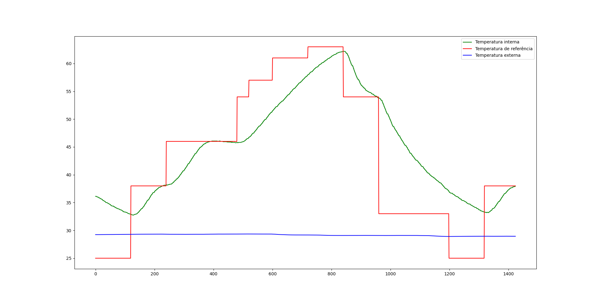
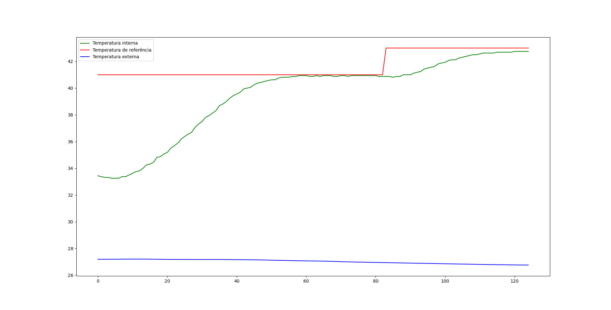

# Trabalho1-FSE

**Aluno:** João Pedro Silva de Carvalho
**Matricula:** 180033743

## Uso
### Como compilar

Para compilar:
```shell
make
```
Para rodar:

```shell
make run
```

# Modo de usar

Assim que você iniciar o programa, poderá escolher entre configurar ou não as constantes, podendo usar os valores padrões ou personalidados. 

Após isso você poderá escolher qual tipo de rotina irá usar para controlar a temperatura interna do forno.

A qualquer momento você poderá apertar `ctrl c` ou `ctrl \` para sair do programa de modo seguro (desligando a ventoinha e o resistor, além de fechar as conexões e arquivos abertos)

## Log

O log será armazenado no diretório ./log/log.csv. Ele é resetado a cada execução.

## Curva reflow

Caso queira adicionar um arquivo personalizado de curva reflow, adicione no diretório ./assets/reflow.csv

Para esse tipo de execução foi coletado o log de 1 ciclo do csv disponbilizado no [repositório da disciplina](https://gitlab.com/fse_fga/trabalhos-2021_2/trabalho-1-2021-2/-/tree/main) no arquivo curva_reflow.csv. Em cada tempo dele foi coletado a temperatura de referência de um tempo igual ou inferior, até que o usuário encerre a execução, retornando ao inicio quando o maior tempo fosse atingido. Por isso recomenda-se que o primeiro e o último tempo tenham a mesma temperatura.




## Potenciomentro

Aqui o programa se comunica via UART para obter uma temperatura de referência, e a partir dai fazer com que a temperatura interna se equipare com a temperatura externa. 



## Constantes usadas no PID dos experimentos:

**KP:**50.0
**KI:**0.2
**KD:**400.0

AS constantes foram as mesmas fornecidas pelo README do [repositório da Trabalho](https://gitlab.com/fse_fga/trabalhos-2021_2/trabalho-1-2021-2/-/tree/main), a única excessão foi o KP, pois a curva demonstrou se aproximar mais rapidademente da temperatura ideal caso aumentasse esse valor. Já ao chegar ao patamar ideal, a curma mantia valores muito próximos à temperatura de referência.